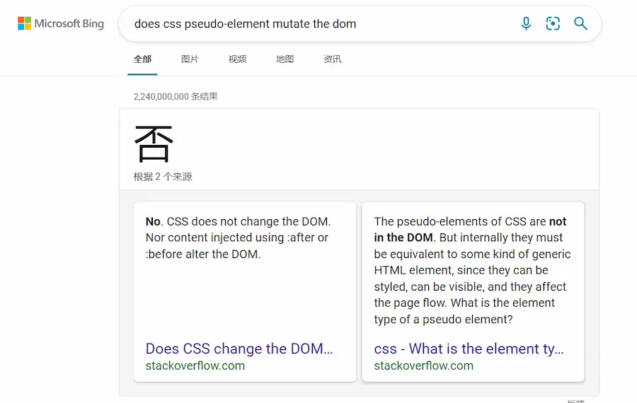

> 参考文献：
>
> - [Critical rendering path - Web Performance | MDN ](https://developer.mozilla.org/en-US/docs/Web/Performance/Critical_rendering_path)
> - [How browsers work (web.dev)](https://web.dev/howbrowserswork/)

关键渲染路径（CRP）是浏览器将 HTML、JS、CSS 渲染成屏幕上的**像素点**的步骤，它主要包含 DOM，CSSOM，渲染树（render tree）和布局（layout）。

优化 CRP 可以提升**首屏渲染**（first render）的性能，这对确保重排和重回以**每秒 60 帧**的频率发生，以防止**卡顿**（junk）。

## 理解 CRP

### 你一生的故事

一个 Web 页面的一生从客户端发起的一个 **HTML Request** 开始，当然，还得由服务端返回一个 **HTML Response** 来阻止你的夭折。

浏览器在接收到 HTML 响应报文后，会将它从**二进制**转化为文本，再对文本进行解析。

在**自上而下**解析 HTML 的过程中，**每当**浏览器遇到一个指向外部资源的**链接**（link），它都会对该资源**新发起**一个网络请求。

> **注意**：这些请求有些是**阻塞**（blocking）的，有些是**非阻塞**（non-blocking）的。如果遇到一个阻塞的请求，那么浏览器会**暂停**（halt）目前对 HTML 的解析，直到该资源被处理完。

浏览器持续进行`HTML --> DOM`这一工作，直到 DOM 被**完全构建**。

但在浏览器解析 HTML 时，当它遇到 CSS 资源时（比如`<link rel="stylesheet" src="...">`、`<style>`标签或者行内样式），就会开始构建 CSSOM。

> 也就是说，DOM 和 CSSOM 的构建是**并行**（Paralleld）的。

当 DOM 和 CSSOM 都被构建完成后，浏览器将这两个结构**绑定**成**渲染树**（render tree），并计算所有**可视元素**的样式（style），

在渲染树建立完成后，浏览器开始计算**布局**（layout），也就是设置所有渲染树上元素的**位置**（location）和**尺寸**（size）。

当布局计算完成后，页面终于会被**渲染**，也就是被绘制成屏幕上的一个个**像素点**（pixel）。

OK，这里有一张示意图，它大致上和前面的描述符合，并且注意 DOM 和 CSSOM 被浏览器并行构建。

### DOM（Document Object Model）

DOM 包含了页面的**所有内容**（all the content），它的构建是**增量**（Incremental）的，也就是非阻塞渲染的。

### CSSOM（CSS Object Model）

CSSOM 包含了 DOM 的**所有样式信息**，它的加载是**阻塞**的，[MDN](https://developer.mozilla.org/en-US/docs/Web/Performance/Critical_rendering_path) 非常决绝地描述道：

> 浏览器在**接收**和**解析**完**所有**的 CSS 之前，都会阻塞渲染。
>
> 因为 CSS 的规则可以被**覆盖**，所以内容无法在 **CSSOM 完全构建**之前被准确渲染，意即没完全构建的 CSSOM 不能用来构建渲染树。

### Render Tree

渲染树包含了页面全部的内容（DOM）和样式（CSSOM）信息，需要注意的是，渲染树只会捕获**可见**（visible）的内容。

> 比方说，HTML 的`<head>`标签，一般是不包含任何可见内容的，所以它不会被囊括到渲染树中。

如果一个元素被设置了`display: none`，那么它以及它后代的所有元素都不会出现在渲染树中。

> 渲染树对元素**可见性**的判断应该主要是基于 CSS `display`规则的，至于**位置**和**尺寸**或者`opacity: 0`和`visibility: hidden`实现的元素隐藏方案都**没有脱离文档流**，那肯定是被渲染树捕获了。

### Layout

布局（Layout）基于**屏幕尺寸**，计算每个元素的位置和尺寸（宽度和高度）。

什么是元素的高度？对于块级元素来说，它的宽度**默认**等于父元素的宽度。而对于`<body>`元素，在不专门定义的情况下，它的宽度就等于**视口**的宽度，这也就是为什么用户的**设备**会影响布局计算。

值得注意的是，对于非 desktop 的设备（比如说 mobile），当设备**旋转**时，浏览器也会重新计算布局。所以布局的发生其实非常频繁，当浏览器被**缩放**（resize）时也会发生。

每当渲染树被修改，比如添加节点、修改内容或者更新元素盒模型的样式等等，都将发生布局。

> **布局（Layout）和重排（Reflow）**
>
> 熟稔八股文的你一定注意到了，上面布局的描述与面试官心心念念的“重排与重绘”中的**重排**（Reflow）有亿点点雷同。
>
> 其实，布局和重排基本上就是一个东西，只不过重排（**Re**flow）在名称上强调它是由于外界因素引起的**重新布局**，即重排建立在第一次布局之上。

### Paint

渲染的最后一步即是将像素**绘制**（Paint）到屏幕上，在绘制完成后，当渲染树更新时，浏览器会对需要**重绘**（Repaint）的区域做**优化**，确保只进行**最少所需**的重绘，其耗时取决于渲染树具体发生了怎样的更新。

由于重绘本身是**很快**的，所以通常它不会是 Web 应用的**性能瓶颈**，对这一步能做的优化比较有限。

> **绘制（Paint）与重绘（Repaint）**
>
> 不同于布局和重排，绘制与重绘通过名称在它们的**同一性**上带给我们多得多的提示。
>
> 所以 Paint 专指第一次绘制，Repaint 专指后续渲染树更新触发的再绘制。我们大概可以这样理解和区分。

### scripts (JS) 和 style sheets (CSS) 的加载

#### Scripts

当遇到`<script>`标签时，浏览器对 HTML 的解析会立即**停止**，直到 script 被**加载**完毕，如果 script 是通过`src`引入的外部资源，那么浏览器请求该资源的过程也是**阻塞** HTML 解析的。

不过，上面的情况适用的是一个 Plain `<script>`标签，而`<script>` 有以下两种特殊 attr：

`defer`：立即开始**下载**脚本，而且这个请求是**并行**的（注意：如果`<script>`不是通过`src`引入内容的话，`defer`不会生效），但在 DOM 解析完毕后（在`DOMContentLoaded`之前）执行。

`async`：HTML5 规范推出的属性，立即**下载**（**并行**地请求），但在下载**完毕**后就**立即执行**。注意，虽然下载是并行的，但其执行还是**阻塞** HTML 解析的。

#### Style sheets (CSS)

概念上，CSS **不会改变 DOM 树**，好像没有必要暂停 HTML 解析等待样式表加载完毕。

> 那么，问题来了，CSS 的**伪元素**（pseudo-element）会不会改变 DOM 结构？毕竟它们是那么神奇，在需求不复杂的情况下，完全可以实现一些“以假乱真”的 DOM 效果。
>
> 不过，答案好像是 **No**。
>
> 
>
> 查询之后，可以知道用 JS 获取伪元素的方法是`window.getComputedStyle()`，所以伪元素本身依旧是纯 CSS 规则，而不是 DOM。

**但是**，有些情况下，**scripts** 可能在 HTML 解析途中需要**样式信息**，这时，如果样式表还没有被加载完毕，那么脚本就可能获得**错误**的信息。

因此，对 CSS 文件的**请求**和**解析**通常都是**阻塞**渲染的，而且最重要的是，不完整的 CSSOM 会**阻塞 script 元素**的加载。
