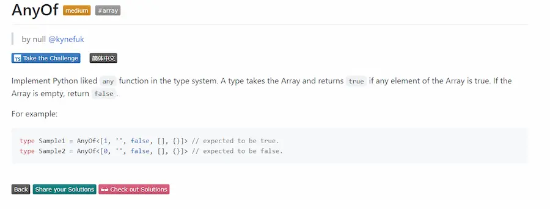

# TypeScript 中的"空对象字面值"

在做 [type chanllenges](https://github.com/type-challenges/type-challenges) 时,
对 [AnyOf](https://github.com/type-challenges/type-challenges/blob/main/questions/00949-medium-anyof/README.md)
这道迷惑了很久：



我最开始的题解如下，将 falsy 的类型统一成一个 tuple，再判断每个元素是否为 trusy。

```ts
type FalsyType = '' | [] | false | 0 | {}

type AnyOf<T extends readonly any[]> = T extends [infer L, ...infer R]
  ? L extends FalsyType
    ? AnyOf<R>
    : true
  : false
```

当然，这种写法是错误的。

因为空对象字面值`{}`是一个 **falsy** 的类型，但`T extends {}`判断的却是`T`是否是一个**对象**,
对于 JavaScript 这样**万物皆对象**的语言这种**条件判断**便显得毫无意义了。

于是在我的题解中，利用`index signature`针对`{}`进行了单独的判断，而不是将它与其他 falsy 类型统一到一个 tuple 中。

```ts
type AnyOf<T extends readonly any[]> = T extends [infer L, ...infer R]
  ? L extends '' | [] | false | 0
    ? AnyOf<R>
    : keyof L extends undefined[]
      ? AnyOf<R>
      : true
  : false
```

今天，偶然在另一个项目的`@typescript-eslint`提示中看到这样的信息：

```xml
Don't use `{}` as a type. `{}` actually means "any non-nullish value".
- If you want a type meaning "any object", you probably want `Record<string, unknown>` instead.
- If you want a type meaning "any value", you probably want `unknown` instead.
- If you want a type meaning "empty object", you probably want `Record<string, never>` instead.
```

翻译过来就是：

不要将`{}`用作类型，因为`{}`实际上表示"**任何非空值**"。

- 如果要表示**任何对象**，用`Record<string, unknown>`。
- 如果要表示**任何值**，用`unknown`。
- 如果要表示**空对象字面值**，用`Record<string, never>`。

据此，就可以将题解改写为如下形式了：

```ts
type FalsyType = '' | [] | false | 0 | Record<string, never>

type AnyOf<T extends readonly any[]> = T extends [infer L, ...infer R]
  ? L extends FalsyType
    ? AnyOf<R>
    : true
  : false
```

最后吐槽一下，当时在 bing、google、stackoverflow 上搜了很久 ts 中空字符字面量怎么表示，但一直没查到,
大概是英语水平不行吧，单凭敲几个关键词还是不能准确检索。
