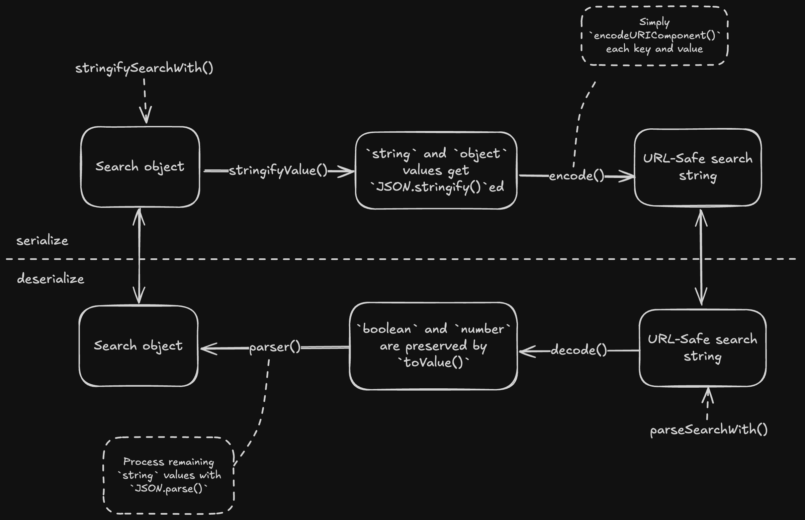
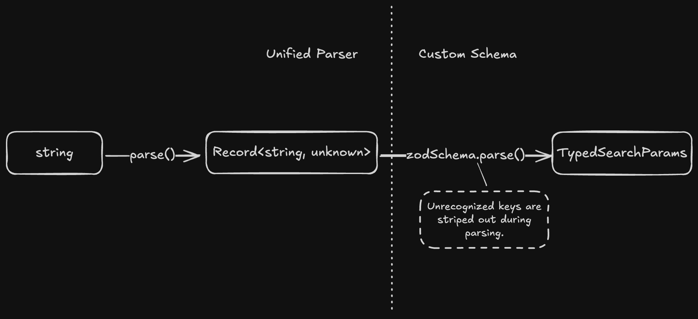

> Note: This article is originally written in [Chinese](/blog/how-to-plagiarize-tanstack-router-search-params) and translated by LLM. Please point out any mistakes or inappropriate phrases. Thank you!

> This article is heavily influenced by [How to Travel with a Salmon](https://www.amazon.com/Travel-Salmon-Other-Essays-Harvest/dp/015600125X), but in all the wrong ways.

## Where the Story Starts

Back in my naïve days as a web developer, when I still believed this job was as fun as it sounded, I arrogantly concluded that the URL was an amazing place to store page states. I got a really simple argument: pulling states from the URL and syncing it with the UI was truly an unbelievably clean data flow. It was stateless, accessible, and supposedly the single source of truth. Done right, one clean URL could, in theory, reflect up to 90% of the page’s content—be it metaphorically for the end user, or practically for your company’s bandwidth-strained server.

To pursue this noble philosophy, I recklessly shipped URL-based state management across a few features at work. These features are scattered across time like breadcrumbs, each still hobbling along on the crutches of extremely fragile De/Serializer, clinging to a surface semblance of elegance. Yes, yet another “use the platform” tragedy—but things changed when [Tanstack Router](https://tanstack.com/router) came along.

> TL;DR: [Code](#the-heist-loot)

## A Pre-announced Heist

If the smug irony above didn’t click, I apologize; I found an [explanation](https://tanstack.com/router/latest/docs/framework/react/guide/search-params#why-not-just-use-urlsearchparams) from dear TanStack Router:

> - Search params represent application state, so inevitably, we will expect them to have the same DX associated with other state managers. This means having the capability of **distinguishing between primitive value types and efficiently storing and manipulating complex data structures** like nested arrays and objects.
> - There are many ways to **serialize and deserialize** state with different tradeoffs. You should be able to choose the best one for your application or at the very least get a better default than `URLSearchParams`.
> - ...

Thanks, [Tanner Linsley](https://github.com/tannerlinsley), and your MIT license, allowing me to quote your words without any guilt (or dignity), to deal with the doubts from chauvinism, social Darwinism, meritocracy, and my impostor syndrome. This tribute goes out to you.

## Brave New World

We (in the name of Tanner Linsley) introduce a revolutionary serialization solution that’s versatile enough for all your JavaScript whims, capable of handling nearly anything you throw at it, and mysteriously unavailable on `npm`—it’s none other than the hallowed `JSON.stringify` and `JSON.parse`.

Tanstack Router wisely defines assumptions for dealing with Search Params serialization/deserialization:

> - The first level of the search params is flat and string based, just like `URLSearchParams`.
> - First level values that are not strings are accurately preserved as actual numbers and booleans.
> - Nested data structures are automatically converted to URL-safe JSON strings.

### Runny Serialization

This design is implemented in Tanstack Router's [searchParams.ts · TanStack/router](https://github.com/TanStack/router/blob/main/packages/react-router/src/searchParams.ts), conveniently available for the aspiring plagiarist:

```ts
/**
 * The serializer factory.
 * @param stringify The custom serializer used to stringify
 * all values in the search params object.
 * @param search The search params object.
 * @returns The ULTIMATE serializer.
 */
export function stringifySearchWith(
  stringify: (search: any) => string,
  parser?: (str: string) => any,
) {
  function stringifyValue(val: any): string {
    /**
     * Stringify all non-null objects!
     */
    if (typeof val === 'object' && val !== null) {
      try {
        return stringify(val)
      } catch (err) {
        // silent
      }
    } else if (typeof val === 'string' && typeof parser === 'function') {
      try {
        // Check if it's a valid parsable string.
        // If it is, then stringify it again.
        // Me: Wait, but why?
        // Saint Tanner: RTFM.
        // Me: Okay, so this extra process on `string` is for
        // `boolean` and `number` preservation, right?
        // Saint Tanner: Yeah, you're getting there.
        parser(val)
        return stringify(val)
      } catch (err) {
        // silent
      }
    }
    // Look, `number` and `boolean` didn't get passed to `stringify()`!
    return val
  }

  // Yes, our ULTIMATE serializer takes any kind of search object,
  // while it, still, needs to be an object.
  return (search: Record<string, any>) => {
    // Spread the search object to execute an implicit iteration,
    // ensuring the output is key-iterable.
    // Me: Wait, isn't this a bit too much? What about side effects?
    search = { ...search }

    // Beautiful FP.
    Object.keys(search).forEach((key) => {
      const val = search[key]
      // Get outta here, `undefined` value!
      if (typeof val === 'undefined' || val === undefined) {
        delete search[key]
      } else {
        // Did you see? Everything except `undefined` gets stringified.
        search[key] = stringifyValue(val)
      }
    })

    // Finally, encode the output string with our Tanstack level `encode()`,
    // which is borrowed from the dear `qss` package. 
    const searchStr = encode(search as Record<string, string>).toString()

    return searchStr ? `?${searchStr}` : ''
  }
}
```

The above snippet reveals a crucial aspect of Tanstack Router’s Search Params API, and partially implements our first assumption:

> The first level of the search params is **flat** and **string based**, just like `URLSearchParams`.

It's the `Object.keys(search).forEach(/*...*/)` that leads us to the flat, string-based search string. No matter what the input is, in the `Object.keys(search).forEach(/*...*/)` gate, it will be flattened into a single layer structure for subsequent encoding.

And you may noticed, the `encode()` function is a lightweight utility sourced from the [`qss`](https://github.com/lukeed/qss) library, designed to serialize search objects into URL-safe strings, very fast, since this procedure is a so-called hot-path.

```ts
/**
 * Encodes an object into a query string.
 * @param obj - The object to encode into a query string.
 * @param [pfx] - An optional prefix to add before the query string.
 * @returns The encoded query string.
 * @example
 * ```
 * // Example input: encode({ token: 'foo', key: 'value' })
 * // Expected output: "token=foo&key=value"
 * ```
 */
export function encode(obj: any, pfx?: string) {
  let k,
    i,
    tmp,
    str = ''

  for (k in obj) {
    if ((tmp = obj[k]) !== void 0) {
      if (Array.isArray(tmp)) {
        for (i = 0; i < tmp.length; i++) {
          str && (str += '&')
          str += encodeURIComponent(k) + '=' + encodeURIComponent(tmp[i])
        }
      } else {
        str && (str += '&')
        str += encodeURIComponent(k) + '=' + encodeURIComponent(tmp)
      }
    }
  }

  return (pfx || '') + str
}
```

This is a trivial piece of code with non-trivial readability: `encode()` accepts an object `obj` and an optional prefix `pfx`. It iterates through each key-value pair in `obj`, applying `encodeURIComponent()` to each to ensure URL safety. When handling non-string types, implicit type [coercion](https://developer.mozilla.org/en-US/docs/Web/JavaScript/Reference/Global_Objects/encodeURIComponent#uricomponent) occurs, meaning `encode()` can handle various data types seamlessly without extra processing. This flexibility and simplicity make it especially powerful in handling diverse data.

### Constipated Deserialization

After serialization comes deserialization—a process more of controlled squeezing than free-flowing:

- `parseSearchWith()` - [searchParams.ts#L10 · TanStack/router](https://github.com/TanStack/router/blob/main/packages/react-router/src/searchParams.ts#L10)
- `decode()` - [qss.ts#L66 · TanStack/router](https://github.com/TanStack/router/blob/main/packages/react-router/src/qss.ts#L66)

```ts
type AnySearchSchema = {}

export function parseSearchWith(parser: (str: string) => any) {
  return (searchStr: string): AnySearchSchema => {
    // First remove the prefix "?"
    if (searchStr.substring(0, 1) === '?') {
      searchStr = searchStr.substring(1)
    }

    // Top-level decode
    const query: Record<string, unknown> = decode(searchStr)

    // Try to parse any query params that might be json
    for (const key in query) {
      const value = query[key]
      // Hey, note this condition!
      // It indicates that some values are already not `string`s, right?
      // That's the magic, `number` and `boolean` are preserved!
      if (typeof value === 'string') {
        try {
          // Just imagine the `parser` is `JSON.parse()`
          query[key] = parser(value)
        } catch (err) {
          // silent
        }
      }
    }

    return query
  }
}

/**
 * Decodes a query string into an object.
 * @param str - The query string to decode.
 * @param [pfx] - An optional prefix to filter out from the query string.
 * @returns The decoded key-value pairs in an object format.
 * @example
 * // Example input: decode("token=foo&key=value")
 * // Expected output: { "token": "foo", "key": "value" }
 */
export function decode(str: any, pfx?: string) {
  let tmp, k
  const out: any = {},
    /**
     * The array of key-value pairs
     */
    arr = (pfx ? str.substr(pfx.length) : str).split('&')

  // Iterate the key-value pairs
  while ((tmp = arr.shift())) {
    /** Index of the equal mark of the to-be-processed key-value pair */
    const equalIndex = tmp.indexOf('=')
    if (equalIndex !== -1) {
      k = tmp.slice(0, equalIndex)
      // Decode the key
      k = decodeURIComponent(k)
      // The still encoded value
      const value = tmp.slice(equalIndex + 1)
      // The `void 0` expression is used to obtain the `undefined` primitive value
      if (out[k] !== void 0) {
        // This branch indicates that the key is already in the processing object,
        // so we need treat it as an array.
        // @ts-expect-error
        out[k] = [].concat(out[k], toValue(value))
      } else {
        // Every `value` needs to go through the `toValue()` transformation
        out[k] = toValue(value)
      }
    } else {
      // When there's no equal mark in the key-value pair,
      // we treat it as a key with an empty string as value,
      // so we only decode the key here.
      k = tmp
      k = decodeURIComponent(k)
      out[k] = ''
    }
  }

  return out
}

/**
 * Converts a `string` value to its **appropriate** type (`string`, `number`, `boolean`).
 * @param mix - The `string` value to convert.
 * @returns The converted value.
 * @example
 * // Example input: toValue("123")
 * // Expected output: 123
 */
function toValue(mix: any) {
  // Here we filter out the `''` value early
  if (!mix) return ''

  // Decode first
  const str = decodeURIComponent(mix)

  // Boolean
  if (str === 'false') return false
  if (str === 'true') return true

  // Number
  return +str * 0 === 0 && +str + '' === str ? +str : str
}
```

As you see, `parseWithSearch()`, serves as the factory function of the deserializer, although we can treat it as a placeholder for a custom parser, whose moment of glory may still be ahead. Now, we only need to focus on how it works as the entry point of the deserialization process when using the default `JSON.parse()` parser:

1. A trivial job: remove the prefix `?` of the search string, otherwise it will lead to food poisoning;
2. The delicate logic happens in the `decode()` function, which is borrowed from the `qss` package. It correctly decodes the `encode` output:
    1. Quite primitive, `decode()` first splits `str` into individual `key=value` pairs according to the delimiter `&`, and then processes them one by one;
    2. For each `key=value`, `decode()` first decodes the `key` using `decodeURIComponent()`, and then passes the `value` to the magical `toValue()` function;
    3. `toValue()` lives up to its name, it rescues the unfair treatment of `string` in `stringifySearchWith()`: after fully `decodeURIComponent()` on the `value`, it forcefully converts the `string` to `number` or `boolean`;
3. The downstream processing is rather rough, for each `string` type `value` in the `query` object outputted by `decode()`, `parseWithSearch()` passes it to the parser `JSON.parse()`, in the hope of obtaining a `string` or **arbitrary complex** structure.

## Recap

Here is a rough diagram of the (de)serialization process, just for your reference:



## Trust Your Input, or Not to Be?

If you are unlucky enough, just like me, to be given the revelation of Search Params, and have been let down by the stubborn [`URLSearchParams`](https://developer.mozilla.org/en-US/docs/Web/API/URLSearchParams), then you will inevitably feel ashamed of your narrow-minded loyalty to TypeScript in your heart, when you have to manually specify or transform the type of every single parameter. Fortunately, in this post-Zod era, if we ignore the moral condemnation of introducing more carbon emissions (what we do by default), tools like [You-Know-Which](https://zod.dev/) will make TypeScript Great Again.

Well, as [Validating Search Params](https://tanstack.com/router/latest/docs/framework/react/guide/search-params#validating-search-params) states, there are two steps in the actual usage of Search Params in Tanstack Router:

1. **Unified Parser** - Which is the `parseSearchWith()` we have already analyzed, by default, all Search Params are parsed by it, but the output is always typed as `Record<string, unknown>`;
2. **Custom Validation** - We, as developers, can define our own Validator (e.g. [Zod](https://zod.dev/)) to perform more precise and flexible type validation on Search Params.



## The Heist Loot

At this stage, we are already capable of implementing a Search Params API that resembles Tanstack Router's in a [React Router](https://reactrouter.com)-based project.

```ts
import { useLocation, useNavigate, type NavigateOptions } from 'react-router-dom'
import { type ZodRawShape, z } from 'zod'

import { parseSearchWith, stringifySearchWith } from './wherever-you-put-them'

const defaultParseSearch = parseSearchWith(JSON.parse)
const defaultStringifySearch = stringifySearchWith(JSON.stringify)

/**
 * Helper hook to use typed Search Params with Zod Schema validation.
 * @param searchZodSchema - The Zod Schema for the Search Params.
 * @returns Like `useState()` - a tuple of typed search params object and its setter.
 */
function _useSearchParams<Schema extends ZodRawShape>(searchZodSchema: z.ZodObject<Schema>) {
  const navigate = useNavigate()
  /**
   * Retrieve the `search` string from the hook from React Router,
   * so that it aligns with the Router's lifecycle.
   */
  const location = useLocation()

  const search = location.search

  type SearchParams = z.infer<typeof Schema>

  const searchParams = useMemo<SearchParams>(() => {
    // First, parse as `Record<string, unknown>`
    const parsed = defaultParseSearch(search)

    // Then, validated with Zod schema.
    // By default unrecognized keys get stripped out here.
    const validated = searchZodSchema.parse(parsed)

    return validated
  }, [search])

  const setSearchParams = useCallback((nextSearchParams: SearchParams, options?: NavigateOptions) => {
    const nextSearch = defaultStringifySearch(nextSearchParams)

    /**
     * Use `navigate()` to update search params,
     * because `setParams()` from `useSearchParams()`
     * does additional encoding.
     * @see https://github.com/remix-run/react-router/blob/7372affd445eaa16d7866bc97ef14cb61361bff5/packages/react-router-dom/index.tsx#L1497
     * @see https://github.com/remix-run/react-router/blob/main/packages/react-router-dom/dom.ts#L79
     */
    return navigate({
      search: nextSearch,
    }, options)
  }, [navigate])

  return [searchParams, setSearchParams] as const
}

// Usage
const productSearchSchema = z.object({
  page: z.number().default(1),
  filter: z.string().default(''),
  sort: z.enum(['newest', 'oldest', 'price']).default('newest'),
})

function useProductListSearch() {
  return _useSearchParams(productSearchSchema)
}

// In your component
function ProductList() {
  // Fully typed search params!
  const [searchParams, setSearchParams] = useProductListSearch()
  // searchParams.page
  // searchParams.filter
  // searchParams.sort

  // ...
}
```
