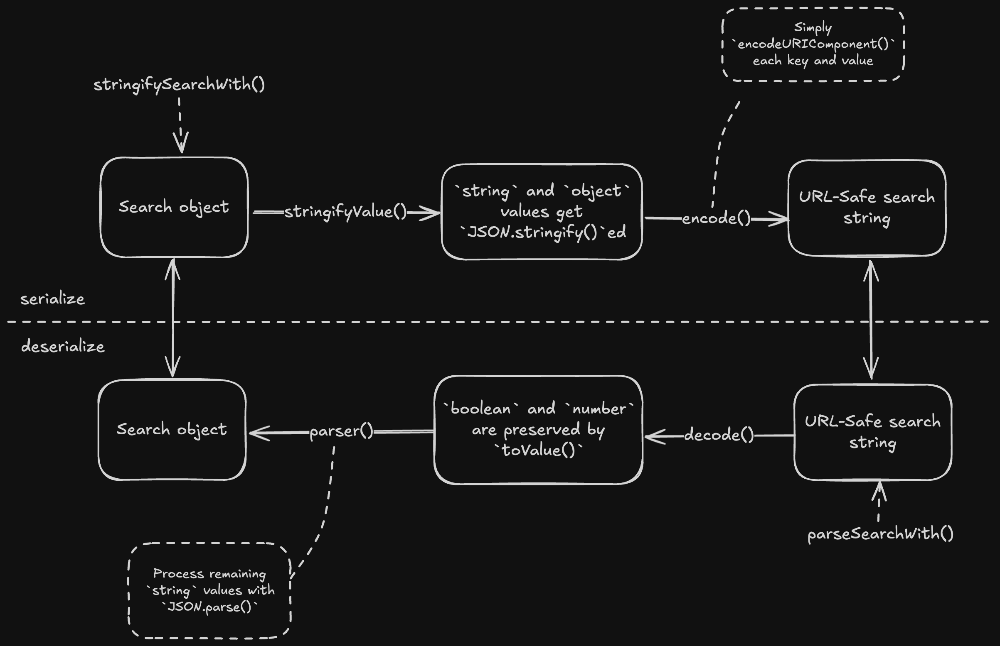
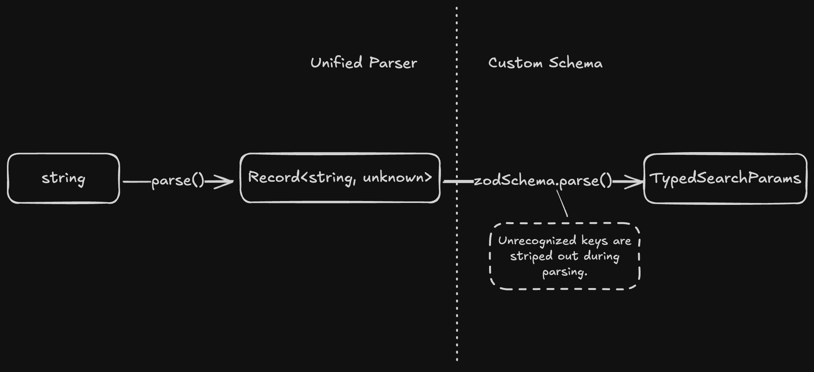

> 本文行文风格极大程度上受[《如何带着三文鱼旅行》](https://book.douban.com/subject/35706102/)的影响，尽管是坏的意义上。

## 梦开始的地方

在我还年少无知、初入 Web 开发世界并以为这是一项妙趣横生的工作时，我就不可一世地认为，URL 是储存页面状态的一个绝佳场所。我的论据很简单，从 URL 读取状态并同步 UI 真是一条简洁的 Data Flow，作为这条链路的 Single Source of Truth，URL 的可访问性很符合 Web 无状态的服务本质。理论上，单单一条处理得当的 URL 就能反映 90% 的页面内容（不管是作为隐喻面对用户，还是针对你吞吐量岌岌可危的服务）。

为了实践这高贵的理念，我已经不知好歹地在好几个工作上的 feature 中落地了尊崇 Search Params 的模式，这些可怜的 feature 断断续续、非正态地分布在估值一年的时间长河中，时至今日依然揣着它们脆弱的 De/Serializer 牌拐杖维持那份表面的优雅。是的，又一桩“use the platform”悲剧，让我们默哀三秒，然后踏入这场剽窃之旅。

> TL;DR: [Code](#剽窃成果)

## 一桩事先张扬的剽窃

如果你没有看明白上面自作聪明的揶揄，别担心，我从亲爱的 [TanStack Router](https://tanstack.com/router/latest/docs/framework/react/guide/search-params#why-not-just-use-urlsearchparams) 那找到了一份解释：

> - Search params represent application state, so inevitably, we will expect them to have the same DX associated with other state managers. This means having the capability of **distinguishing between primitive value types and efficiently storing and manipulating complex data structures** like nested arrays and objects.
> - There are many ways to **serialize and deserialize** state with different tradeoffs. You should be able to choose the best one for your application or at the very least get a better default than `URLSearchParams`.
> - ...

谢谢你，[Tanner Linsley](https://github.com/tannerlinsley)！以及你的 MIT 协议，允许我毫无顾忌（和尊严）地引用你的只言片语，以应付那些来自沙文、社会达尔文、优绩主义、imposter syndrome 患者和我脑海的质疑。这篇剽窃向你致敬。

## 美丽新世界

我们（以 Tanner Linsley 之名）引入了一套全新的序列化解决方案，它在 JavaScript 世界无所不包，能够（几乎）完备地处理你的任何需求，最神秘的是你无法在 npm 上找到它的正式发行版本——没错，它就是崭新的 `JSON.stringify` 和 `JSON.parse`。

Tanstack Router 英明地引入了其对 Search Params 的序列/反序列化问题的 assumption：

> - The first level of the search params is flat and string based, just like `URLSearchParams`.
> - First level values that are not strings are accurately preserved as actual numbers and booleans.
> - Nested data structures are automatically converted to URL-safe JSON strings.

### 拉稀的序列化

这套设计在 [router/packages/react-router/src/searchParams.ts at main · TanStack/router](https://github.com/TanStack/router/blob/main/packages/react-router/src/searchParams.ts) 中被实现，以便于为我们这些剽窃者所用，并肆意评头论足：

```ts
/**
 * The serializer factory.
 * @param stringify The custom serializer used to stringify
 * all values in the search params object.
 * @param search The search params object.
 * @returns The ULTIMATE serializer.
 */
export function stringifySearchWith(
  stringify: (search: any) => string,
  parser?: (str: string) => any,
) {
  function stringifyValue(val: any): string {
    /**
     * Stringify all non-null objects!
     */
    if (typeof val === 'object' && val !== null) {
      try {
        return stringify(val)
      } catch (err) {
        // silent
      }
    } else if (typeof val === 'string' && typeof parser === 'function') {
      try {
        // Check if it's a valid parsable string.
        // If it is, then stringify it again.
        // Me: Wait, but why?
        // Saint Tanner: RTFM.
        // Me: Okay, so this extra process on `string` is for
        // `boolean` and `number` preservation, right?
        // Saint Tanner: Yeah, you're getting there.
        parser(val)
        return stringify(val)
      } catch (err) {
        // silent
      }
    }
    // Look, `number` and `boolean` didn't get passed to `stringify()`!
    return val
  }

  // Yes, our ULTIMATE serializer takes any kind of search object,
  // while it, still, needs to be an object.
  return (search: Record<string, any>) => {
    // Spread the search object to execute an implicit iteration,
    // ensuring the output is key-iterable.
    // Me: Wait, isn't this a bit too much? What about side effects?
    search = { ...search }

    // Beautiful FP.
    Object.keys(search).forEach((key) => {
      const val = search[key]
      // Get outta here, `undefined` value!
      if (typeof val === 'undefined' || val === undefined) {
        delete search[key]
      } else {
        // Did you see? Everything except `undefined` gets stringified.
        search[key] = stringifyValue(val)
      }
    })

    // Finally, encode the output string with our Tanstack level `encode()`,
    // which is borrowed from the dear `qss` package. 
    const searchStr = encode(search as Record<string, string>).toString()

    return searchStr ? `?${searchStr}` : ''
  }
}
```

上面这段短小精悍的 snippet 为我们揭示了 Tanstack Router Search Params API 强大秘密的一角，并且**部分实现**了我们所提到 assumption 的第一条：

> The first level of the search params is **flat** and **string based**, just like `URLSearchParams`.

正是 `Object.keys(search).forEach(/*...*/)` 这一入口，导向了我们平铺（在顶层上）直叙（毫无吸引力的字符串）的 search string 造物。无论什么样的输入，在 `Object.keys(search).forEach(/*...*/)` 这一关，都会被扁平化为一层结构体，以便后续的编码处理。

另外，你可能注意到了 `encode()` 这个机械降神的函数，它由先知 Tanstack Router 从 [`qss`](https://github.com/lukeed/qss) 中汲取而来，以为将 search object 转化为 URL-safe string 这条 hot path 极致赋能。[router/packages/react-router/src/qss.ts at main · TanStack/router](https://github.com/TanStack/router/blob/main/packages/react-router/src/qss.ts) 中记录了其具体的实现：

```ts
/**
 * Encodes an object into a query string.
 * @param obj - The object to encode into a query string.
 * @param [pfx] - An optional prefix to add before the query string.
 * @returns The encoded query string.
 * @example
 * ```
 * // Example input: encode({ token: 'foo', key: 'value' })
 * // Expected output: "token=foo&key=value"
 * ```
 */
export function encode(obj: any, pfx?: string) {
  let k,
    i,
    tmp,
    str = ''

  for (k in obj) {
    if ((tmp = obj[k]) !== void 0) {
      if (Array.isArray(tmp)) {
        for (i = 0; i < tmp.length; i++) {
          str && (str += '&')
          str += encodeURIComponent(k) + '=' + encodeURIComponent(tmp[i])
        }
      } else {
        str && (str += '&')
        str += encodeURIComponent(k) + '=' + encodeURIComponent(tmp)
      }
    }
  }

  return (pfx || '') + str
}
```

这是一段简单的代码，而其易读性却不简单。在接收一个对象 `obj` 和可选的前缀 `pfx` 后，`encode()` 会将 `obj` 中的每个键值对**分别**调用 `encodeURIComponent()`，需要注意的是，其中的 `tmp` 或者 `tmp[i]` 并不一定是字符串，而仍然可能是除 `object` 外的任意类型。是的，`encodeURIComponent()` 在处理非字符串时将执行 [coercion](https://developer.mozilla.org/en-US/docs/Web/JavaScript/Reference/Global_Objects/encodeURIComponent#uricomponent)。

让我们回过神来，`encode()` 正是负责实现上述 assumption 的第三条：

> Nested data structures are automatically converted to **URL-safe** JSON strings.

同时，在 Tanstack Router 中，默认伴 `stringifySearchWith()` 同行的便是我们的 `JSON.stringify()`，它就是 Router 无可否认、最为正统的 THE DEFAULT serializer。

### 便秘的反序列化

正如序列化像是一场拉稀，将任意的输入吞吐为难辨究竟的絮状物（字符串），反序列化则是一场便秘：

- `parseSearchWith()` - [searchParams.ts#L10 · TanStack/router](https://github.com/TanStack/router/blob/main/packages/react-router/src/searchParams.ts#L10)
- `decode()` - [qss.ts#L66 · TanStack/router](https://github.com/TanStack/router/blob/main/packages/react-router/src/qss.ts#L66)

```ts
type AnySearchSchema = {}

export function parseSearchWith(parser: (str: string) => any) {
  return (searchStr: string): AnySearchSchema => {
    // First remove the prefix "?"
    if (searchStr.substring(0, 1) === '?') {
      searchStr = searchStr.substring(1)
    }

    // Top-level decode
    const query: Record<string, unknown> = decode(searchStr)

    // Try to parse any query params that might be json
    for (const key in query) {
      const value = query[key]
      // Hey, note this condition!
      // It indicates that some values are already not `string`s, right?
      // That's the magic, `number` and `boolean` are preserved!
      if (typeof value === 'string') {
        try {
          // Just imagine the `parser` is `JSON.parse()`
          query[key] = parser(value)
        } catch (err) {
          // silent
        }
      }
    }

    return query
  }
}

/**
 * Decodes a query string into an object.
 * @param str - The query string to decode.
 * @param [pfx] - An optional prefix to filter out from the query string.
 * @returns The decoded key-value pairs in an object format.
 * @example
 * // Example input: decode("token=foo&key=value")
 * // Expected output: { "token": "foo", "key": "value" }
 */
export function decode(str: any, pfx?: string) {
  let tmp, k
  const out: any = {},
    /**
     * The array of key-value pairs
     */
    arr = (pfx ? str.substr(pfx.length) : str).split('&')

  // Iterate the key-value pairs
  while ((tmp = arr.shift())) {
    /** Index of the equal mark of the to-be-processed key-value pair */
    const equalIndex = tmp.indexOf('=')
    if (equalIndex !== -1) {
      k = tmp.slice(0, equalIndex)
      // Decode the key
      k = decodeURIComponent(k)
      // The still encoded value
      const value = tmp.slice(equalIndex + 1)
      // The `void 0` expression is used to obtain the `undefined` primitive value
      if (out[k] !== void 0) {
        // This branch indicates that the key is already in the processing object,
        // so we need treat it as an array.
        // @ts-expect-error
        out[k] = [].concat(out[k], toValue(value))
      } else {
        // Every `value` needs to go through the `toValue()` transformation
        out[k] = toValue(value)
      }
    } else {
      // When there's no equal mark in the key-value pair,
      // we treat it as a key with an empty string as value,
      // so we only decode the key here.
      k = tmp
      k = decodeURIComponent(k)
      out[k] = ''
    }
  }

  return out
}

/**
 * Converts a `string` value to its **appropriate** type (`string`, `number`, `boolean`).
 * @param mix - The `string` value to convert.
 * @returns The converted value.
 * @example
 * // Example input: toValue("123")
 * // Expected output: 123
 */
function toValue(mix: any) {
  // Here we filter out the `''` value early
  if (!mix) return ''

  // Decode first
  const str = decodeURIComponent(mix)

  // Boolean
  if (str === 'false') return false
  if (str === 'true') return true

  // Number
  return +str * 0 === 0 && +str + '' === str ? +str : str
}
```

这是一段前后联动紧密的代码，首先，`parseWithSearch()` 是反序列化器的工厂函数，尽管我们大可以将它视为一个自定义 parser 的 placeholder，它大放异彩的时刻可能还在未来。眼光回到现在，我们尚只需关注，在使用默认的 `JSON.parse()` 参数时，其返回的 parser 函数作为反序列化工程的入口，它如何工作：

1. 举手之劳！去掉 search string 的前缀 `?`，否则将导致食物中毒；
2. 精密的逻辑发生在上消化道 `decode()` 中，这位来自 `qss` 的大法官能够将 `encode` 产物正确地还原：
    1. 相当原始地，`decode()` 首先将 `str` 根据分隔符 `&` 分割为各个 `key=value` 对，然后依次处理；
    2. 对每个 `key=value`，`decode()` 会首先将 `key` 使用 `decodeURIComponent()` 解码，然后将 value 传递给神奇的 `toValue()`；
    3. `toValue()` 名副其实，它救赎了 `stringifySearchWith()` 中对 `string` 的不公处理：它在补足对 `value` 的 `decodeURIComponent()` 后，专断地将 `string` 转化为 `number` 或 `boolean`；
3. 下消化道则显得相当大刀阔斧，对 `decode()` 输出的 `query` 对象中的每个 `string` 类型的 `value`，`parseWithSearch()` 会将其传递给 parser `JSON.parse()`，以期获得 `string` 或者**任意复杂**的结构体。

### Recap

为您敬上，这是一张粗略的序列化/反序列化流程图：



## 相信你的输入，or not to be？

如果你不幸跟我一样，被迫得到 Search Params 的天启，而又曾被生性执拗的 [`URLSearchParams`](https://developer.mozilla.org/en-US/docs/Web/API/URLSearchParams) 所辜负，那么你一定会对自己狭隘心胸中对 TypeScript 的愚忠感到羞愧。万幸，在这个后 Zod 时代，如果我们无视引入更多碳排放的道德谴责（是的，我们始终无视），像 [You-Know-Which](https://zod.dev/) 这样的 Runtime Validation 工具，将 Make TypeScript Great Again。

如 [Validating Search Params](https://tanstack.com/router/latest/docs/framework/react/guide/search-params#validating-search-params) 所揭晓的，Tanstack Router 在实际使用中对 Search Params 的解析分为两步:

1. **Unified Parser** - 即已经在上面得到剖析的 `parseSearchWith()`，默认情况下，所有 Search Params 统一先接受它的解析，但不可接受的是，它返回的类型永远是 `Record<string, unknown>`；
2. **Custom Validation** - 开发者，也就是我们，能够自定义的 Validator（例如 [Zod]((https://zod.dev/)) 这样的 Schema-based Validator），以对 Search Params 进行更为精细、同时灵活的类型验证。



## 剽窃成果

有了以上这些条件，我们已经能够在垂垂老矣的 [React Router](https://reactrouter.com) 项目中，实现一套剽窃 Tanstack Router 的 Search Params API。

```ts
import { useLocation, useNavigate, type NavigateOptions } from 'react-router-dom'
import { type ZodSchema, z } from 'zod'

import { parseSearchWith, stringifySearchWith } from './wherever-you-put-them'

const defaultParseSearch = parseSearchWith(JSON.parse)
const defaultStringifySearch = stringifySearchWith(JSON.stringify)

/**
 * Helper hook to use typed Search Params with Zod Schema validation.
 * @param searchZodSchema - The Zod Schema for the Search Params.
 * @returns A tuple of typed Search Params and the setter.
 */
function _useSearchParams(searchZodSchema: Schema extends ZodSchema) {
  const navigate = useNavigate()
  /**
   * Retrieve the `search` string from the hook from React Router,
   * so that it aligns with the Router's lifecycle.
   */
  const location = useLocation()

  const search = location.search

  const searchParams = useMemo(() => {
    // First, parsed to `Record<string, unknown>`
    const parsed = defaultParseSearch(search)

    // Then, validated with Zod
    const validated = searchZodSchema.parse(parsed)

    return validated
  }, [search])

  type SearchParams = z.infer<typeof Schema>

  const setSearchParams = useCallback((nextSearchParams: SearchParams, options?: NavigateOptions) => {
    const nextSearch = defaultStringifySearch(nextSearchParams)

    /**
     * Use `navigate` instead of the setter returned by React Router's `useSearchParams()`
     * to update the search, since React Router's Search Params API do additional
     * encoding, which is not compatible with our custom serializer.
     */
    return navigate({
      pathname: '.',
      search: nextSearch,
    }, options)
  }, [navigate])

  return [searchParams, setSearchParams] as const
}

// Usage
const productSearchSchema = z.object({
  page: z.number().default(1),
  filter: z.string().default(''),
  sort: z.enum(['newest', 'oldest', 'price']).default('newest'),
})

function useProductListSearch() {
  return _useSearchParams(productSearchSchema)
}

// In your component
function ProductList() {
  // Fully typed search params!
  const [searchParams, setSearchParams] = useProductListSearch()
  // searchParams.page
  // searchParams.filter
  // searchParams.sort

  // ...
}
```
