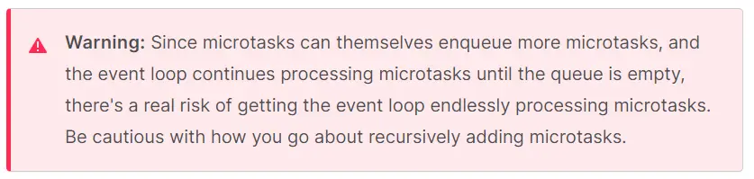
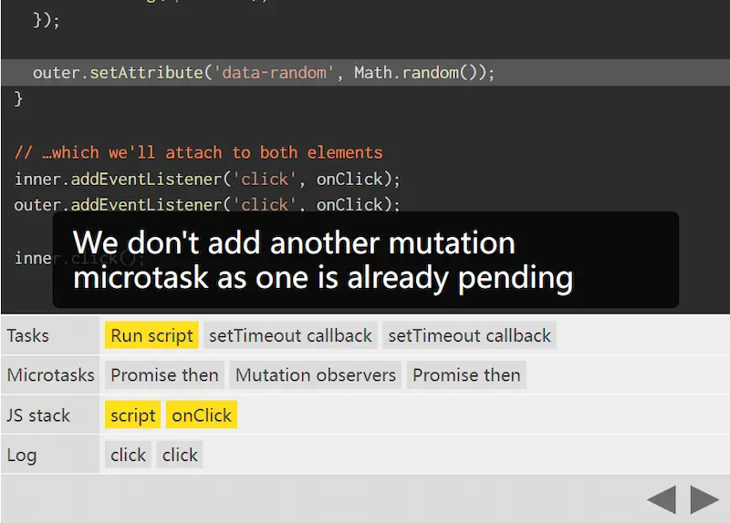

**参考资料**：

- [Tasks, microtasks, queues and schedules - JakeArchibald.com](https://jakearchibald.com/2015/tasks-microtasks-queues-and-schedules/?utm_source=html5weekly)
- [浏览器事件循环机制\_唐霜的博客 (tangshuang.net)](https://www.tangshuang.net/7617.html)

JavaScript 是一门**单线程同步**编程语言，任务只能在主线程上一个一个**串行**地执行。

为了让多类型的任务在主线程上有条不紊地执行，JavaScript 引入了**任务队列**（Task Queue）和**事件循环**（Event Loop）。

虽然 JS 为单线程，但一个页面（tab）是**多线程**的，其中最主要的是 JS 引擎线程（V8）、GUI 渲染引擎线程。

每一个线程有**自己的**事件循环，且**同源**的多个**窗口**之间**共享**一个事件循环，因此它们可以同步地通信。

一个事件循环有**多个**任务源（source），这些源维护它们内部任务的执行次序，但浏览器每次循环（每一次循环被称为一`Tick`）会**挑选一个源**，从中取出一个任务。这使得浏览器能优先考虑**性能敏感**的任务，比如用户输入。

**任务**是设置（scheduled）好的，因此浏览器能从其内部进入 JavaScript/DOM 域，以确保这些行为是顺序发生的。在任务之间，浏览器可能会进行渲染更新。

从一次鼠标点击中获取事件回调就需要设置一个任务，同样，解析 HTML、`setTimeout`也是。

**微任务**（Microtasks）一般是应该在当前执行的脚本完成后，立即发生的行为，它们可能有点**异步**，但不创建新的任务。

当执行栈中的任务执行完毕，没有其他的 JS 正在主线程运行时，微任务将被处理。在微任务中创建的微任务也会被添加到当前任务的**微任务队列**中。

> 注意：当引擎遇到一个微任务后，会在将其加入微任务队列后，**跳过**其整体表达式的执行。
>
> ```javascript
> Promise.resolve()
>   // microtask1
>   .then(() => {
>     console.log('promise1')
>   })
>   // microtask2
>   .then(() => {
>     console.log('promise2')
>   })
>
> console.log('end')
> ```
>
> 上述代码中，当引擎遇到`microtask1`时，将其加入微任务队列，但此时不会<del>扫描</del>将`microtask2`注册到微任务队列中（因为前一个 promise 还未落定）；在执行完脚本后，取出`microtask1`执行，此时才扫描到`microtask2`，将其加入微任务队列。

由于执行微任务可以引入新的微任务，且这些微任务都会在当前宏任务下执行完毕，所以微任务可能一直占用当前的引擎，**无限阻塞**接下来的宏任务。



## 什么会创建宏任务（macrotask）？

常见的：

- 直接执行一个新的 JavaScript 程序或子程序时（比方说从控制台、一个`<script>`元素 / JS 文件中）。
- 触发一个 UI 交互事件时，**事件的处理回调**（event handler callback）将加入宏任务队列。

> **注意：**
>
> - 由事件冒泡或捕获导致的多个事件处理回调属于**同一个**宏任务。
> - JS 命令式触发的事件**也会传播**。
> - 在宏任务中，只要**执行栈**（JS Stack）不为空，就无法开始**执行微任务**，要注意用**顶级函数调用**触发微任务的情况。

- 当一个定时器（`setTimeout()`、`setInterval()`）到达时，其**回调**被加入到宏任务队列中。

不常见的：

- Node.js API `setImmediate`的回调会加入到宏任务队列。

- 负责 Worker 或 Window 之间通信的`portMessage`回调。
- MessageChannel、I/O ...

## 什么会创建微任务（microtask）？

常见的：

- Promise 对象用`then()`注册的回调。
- `async/await`中的`await`语句（statement）。
- `MutationObserver`的回调。

> **注意**：当前宏任务下有`pending`状态的`MutationObserver`回调时，**不会为其他`MutationObserver`回调再创建新的微任务**。
>
> 

不常见的：

- Node.js 中的`process.nextTick()`的回调。

## 什么是**空**的执行栈？

上文中提到，微任务只在当前宏任务完成，且**执行栈为空**时，开始执行。

> Microtasks execute in order, and are executed:
>
> - after every callback, as long as **no other JavaScript is mid-execution**
> - at the end of each task.

对执行栈的认识离不开**作用域**（Scoping）这个概念，一般来说，我们认为执行栈以**函数调用**为单位，将其以**上下文帧**的形式压入栈中,
每一帧包含函数的**作用域**。

在我的理解里，如果出现**闭包**（或其他对上层作用域的引用）时，那个包含被引用值的上下文就**无法**出栈，即使它的函数体已经被完全执行（evaluated）,
其上下文依然存在执行栈中，这种情况下的执行栈是否该被认为是空？

下面是一个该情境的例子：

```js
// script.js
let ref = 1

new Promise((resolve) => {
  console.log('executor fire')

  setTimeout(() => resolve(ref))

  console.log('executor done')
}).then((val) => {
  console.log(`promise 1: ${val}`)
})

Promise.resolve(2).then((val) => console.log(`promise 2: ${val}`))

console.log('script ends')

// output:
// 1. executor fire
// 2. executor done
// 3. script ends
// 4. promise 2: 2
// 5. promise 1: 1
```

其中，在 script 中产生的 timeout 宏任务引用了 script 作用域中的`ref`变量，那么在 evaluate 完 script 后,
script 作用域还保留在执行栈中，但第二个 promise 产生的微任务却被执行了。并且由于第二个 promise 是一个初始化时就已经 fulfilled
的`Promise.resolve()`，所以其`then()`回调在自上而下执行 script 时就已经被推入微任务队列。

上面的结果可以说明，一个执行上下文帧在执行栈中**保留**并不代表 JS 代码**正在执行**（mid-execution），关于作用域与上下文的知识，自己还需要更深入地了解。
