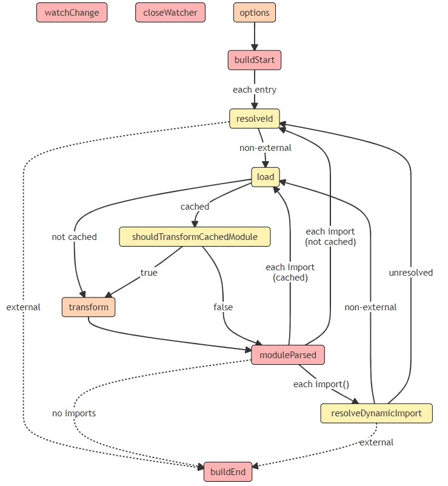

个人博客, 和官方文档一样, 是 **SSG(Static Site Generator)** 的典型用例。

但写这个博客时没有用 [Vitepress](https://vitepress.vuejs.org/) 、 [Docusaurus](https://docusaurus.io/) 等 SSG 框架,
一方面是为了练习写 React, 另一方面是对 SSG 比较感兴趣, 想对其有更多的了解。

但这个博客也不是手搓`markdown-it`那种硬核、或者说深入的项目, 而是简单的对一些提供 SSG 关键功能的插件的集成而已。

在具体陈述之前, 先列举一下项目中用到的两个关键插件：

- `vite-plugin-pages` - 自动生成路由；
- `@mdx-js/rollup` - 负责处理(解析、渲染) markdown 文件。

## 框架视点下, SSG 的基本要素

这里的框架指的是 bundler(webpack, rollup ...) 以及业务框架(Vue, React ...), 它们已经解决了项目构建与用户交互的需求。

在它们的基础上, 我认为一个 SSG 应用还应具备的基本要素是：**markdown 处理(markdown processing)** 和 **自动路由(auto routes generation)**。

在写到“基本要素”时, 我想到 **basic features** 和 **minimum requirements** 两种描述, 我认为其中 minimum requirements 更为合适,
或者抛除中文原意, 用 **additional requirements** 来表示框架的在场。

这两个特性结合就能形成一个典型的用例: 在一个指定的目录下, 解析所有 markdown 文件并渲染为 DOM(或 VNode 等过渡形式),
并自动为这些元素生成供框架使用的路由。

听上去就和各种 SSG 框架 playground 中最简单的例子大差不差了, 本文的探讨大概也就到兹范围。

### markdown 处理

不一定是 markdown, 只要有办法**处理**, 你可以用任何语言编写博客的文章, 但 markdown 无疑是最为流行的一员, 它得到了绝大多数生态(来自官方或社区)的支持。

**处理**可以分为**解析**和**渲染**两步：

- **解析** - 根据原始文本生成 AST。
- **渲染** - 根据 AST 生成 HTML 或过渡产物。

鉴于 React 的使用需求, 博客选择 [MDX](https://mdxjs.com/) 作为 markdown 文件的处理引擎。

> 当然, 除了 React 外, MDX 也可以用于其他任何支持 JSX 的框架。

MDX 依赖 [remark](https://github.com/remarkjs/remark) 和 [rehype](https://github.com/rehypejs/rehype) 来转译 markdown：

remark 负责生成 AST , MDX 依据 AST 生成原始的 HTML 文本, 再交由 rehype 解析成目标产物(在该项目中, 即 React Components)。

有趣的是, React Component(或者其他框架的 VDOM) 虽然可以视作 HTML(framework output) 的一种过渡性产物, 但其实在 MDX 处理周期中,
它是先由 HTML(mdx output) 转化成的, 用“同态”来形容或许更为恰当。

虽然`.mdx`文件支持 inline react, 这使得`.mdx`的编写有莫大的潜能, 但博客文章基本上就是用 [CommonMark](https://commonmark.org/) 写的,
所以我选择用各种 MDX plugins 对转译结果进行预处理, 这种**静态**的方式也符合 SSG 的理念。

下面列举了该项目使用到的 MDX 插件：

- remark-gfm - 支持 GFM(Github Flavored Markdown)。
- remark-mdx-frontmatter & remark-frontmatter - 解析文本的`frontmatter`, 并将其以 ESM 的风格导出。
- remark-a11y-emoji - 为 emoji 添加`aria-`属性, 使其成为 accessible emoji。
- rehype-highlight - 以`highlight.js`的风格, 为 HTML 中各元素添加`class`名, 然后便可引入自定义的`.css` stylize 自己的博客文章,
  其中当然包括代码的**语法高亮**。
- rehype-slug - 为 title 元素添加`id`属性。
- rehype-toc - 为文本生成 TOC(Table of Content)。

前缀代表插件 hook 进了哪个阶段, 可以看出, `remark`插件多负责 AST 相关的工作, 而`rehype`中可对 HTML 进行处理, 这种处理较于字符串式,
更可能是 DOM 式的。

### 自动路由

SSG 自动路由的思路很简单, 就是用脚本在编译时读取某些目录下的文件(读取哪些目录、哪些文件完全自定义化), 然后生成对应路由即可。

这个需求在 Vite 中，可以用`import.meta.glob`较为容易地实现。

这可能也是为什么 Vitepress 的路由生成都不使用 [Vue Router](https://router.vuejs.org/),
而是另写一个　 LOC < 200 　的脚本。


这对 React 来说应该更为简单, 因为 React Router 的实现比 Vue Router 更为简洁, 虽然这也意味着开发者需要自己做更多的 dirty work。

本项目使用 [vite-plugin-pages](https://github.com/hannoeru/vite-plugin-pages) 读取`/pages`目录下所有后缀名为`.tsx`或`.mdx`的文件,
该插件本身就支持生成 React Router 式的路由。

项目对`vite-plugin-pages`生成的路由集进行一定的处理, 包括用`<article class="prose" />`包装文章 JSX, 作为 **landmark** 且方便**引入样式**。

但这个包装是有条件的, 因为生成的路由集很可能是一个**嵌套路由**, 需要通过`RouteObject`实例的`children`和`element`属性进行区分, 可以使用递归实现。

这里插一个与上一节有关的话题, SSG 一个重要的功能点是 **页面标题随路由改变**, 但由于`vite-plugin-pages`不提供相关 hook,
我们不能直接在插件的`config options`中为路由对应的组件添加监听器,
所以要用到 markdown 的 frontmatter 在编译时获取文章的元信息(meta info, 包括标题、路由、时间等任何信息),
然后将插件返回的路由包装进带有事件监听器的 HOC, 即上面提到的`<article class="prose" ... />`中。

markdown 的 frontmatter 是一个很强力的特性, 它传递的 meta 信息在项目中也用于博客目录的渲染, 项目中与 frontmatter 相关的功能都写成了 React hooks。

## MDX 与 vite-plugin-pages 的加载顺序

> 本节内容与 SSG 无关, 而是关于 Vite 插件的加载

React 环境下的`vite-plugin-pages`将生成 React Router 式的 routes, 那么其扫描的文件应该**已经**是`js`, `ts`, `tsx`代码,
那么在此之前`.mdx`应该已经被`@mdx-js/rollup`转译成`js`代码。

直观上, 在 Vite Config 的`plugins`中`@mdx-js/rollup`应该先于`vite-plugin-pages`, 但实践证明两个插件的顺序并**不影响最终效果**。

> 这里不考虑`vite-plugin-pages`具备先生成某种路由雏形(其路由不包含具体元素, 可能是树形或某种可被解析为树形的形式), 等待`.mdx`文件被转译后再生成路由的**异步**特性, 因为考虑到各种转译插件不一定都是纯净(pure)的, 这会使得插件的设计变得非常耦合。

显然, 这两个插件作用于整个应用 build 过程中的**不同阶段**。

`@mdx-js/rollup`定义的 plugin 使用到 build hooks 中的`transform`, 它用于**转换**独立的模块(即某种语言编写的文件), 可返回标准 AST。

```js
// @mdx-js\rollup\lib\index.js

{
  name: '@mdx-js/rollup',
  async transform(value, path) {
    const file = new VFile({value, path})

    if (
      file.extname &&
      filter(file.path) &&
      extnames.includes(file.extname)
    ) {
      const compiled = await process(file)
      return {code: String(compiled.value), map: compiled.map}
      // V8 on Erbium.
      /* c8 ignore next 2 */
    }
  }
}

```

而`vite-plugin-pages`使用到的 hooks 包括来自 rollup 的`resolveId`、`load`, 以及 vite
独有的`configResolved`、`configureServer`, 同时通过`enforce: "pre"`指定插件在 vite core plugins **之前**运行。

```js
// vite-plugin-pages\dist\index.js

{
    name: "vite-plugin-pages",
    enforce: "pre", // runs before vite core plugins
    async configResolved(config) {
      // ...
    },
    api: {
      getResolvedRoutes() {
        return ctx.options.resolver.getComputedRoutes(ctx)
      }
    },
    configureServer(server) {
      ctx.setupViteServer(server)
    },
    resolveId(id) {
      // ...
    },
    async load(id) {
      const {
        moduleId,
        pageId
      } = parsePageRequest(id)
      if (moduleId === MODULE_ID_VIRTUAL
        && pageId
        && ctx.options.moduleIds.includes(pageId))
        return ctx.resolveRoutes();
      if (id === ROUTE_BLOCK_ID_VIRTUAL) {
        return {
          code: "export default {};",
          map: null
        }
      }
      return null
    }
  }

```

我们主要考察 Rollup build hooks, Vite 官方文档显示：`vite-plugin-pages`的`resolveId`和`load`会在`@mdx-js/rollup`的`transform`之前执行,
且它们将在**每次请求模块**时被调用。


这不符合我们 "先解析`.mdx`文件，再生成 React 路由" 的直观想法，




上图中，Rollup 的官方文档指出 build hooks 有多种类型，其不同之处主要体现在**异步、调度**上：

- `resolveId`和`load`都是`first`类型的 hook, 若有多个插件实现了它们, 那这些 hooks 将依次执行,
  直到某一 hook 返回**非**`undefined`或`null`值。
- `transform`则是`sequential`类型的 hook, 若有多个插件实现这一 hook, 它们将依次**阻塞、串行**地执行。

`first`类型的 hooks 是非阻塞式的，所以`load`遇到`await`这样的异步操作时，就会正常跳出当前执行的 hook。

`vite-plugin-pages`生成的路由需要通过`import routes from '~react-pages'`的方式引入,
对该模块的请求**启动**了自动路由的生成，在指定目录的路由完全生成后,
再将形式如下的代码(client)以字符串的形式传递给`transform`：

```js
import React from 'react'
import __pages_import_0__ from '/pages/index.mdx'

const __pages_import_1__ = React.lazy(() => import('/pages/blog/index.tsx'))
const __pages_import_2__ = React.lazy(() =>
  import('/pages/blog/ssg-in-flog.mdx')


const routes = [
  {
    caseSensitive: false,
    path: '/',
    element: React.createElement(__pages_import_0__)
  },
  {
    caseSensitive: false,
    path: 'blog',
    children: [
      // __page_import_1&2__
    ]
  }
]

export default routes

```

该代码引入了路由对应的模块，Vite 继续请求自动路由涉及的文件，而其中的`.mdx`文件就将在各自的`transform`阶段得到转换。

### 结论

没错，我是半途才发现这与两个插件的 **hook 类型根本没啥关系**，单纯是 Vite 构建项目依赖的机制而已...

但是细想也对，现代的打包工具都以 **tree-shaking** 为特征，对特定模块的处理都必须建立在"它会被打包"这一基础上,
这样，也与一开始就被否决的"路由雏形"猜测相映了，它正是"依赖解析"这一更为底层的机制的显现，或者说,
路由雏形是不完整的、**退化**的依赖解析而已。

### Vite specific hooks

下面简单介绍`vite-plugin-pages`中两个 Vite 独有 hooks：

- `configResolved`在 Vite 配置解析完毕后执行, 用于读取和存储配置的解析结果, 在插件中它根据 Vite 应用的环境(React, Solid ...)做出不同的反应。
- `configureServer`用于配置 **dev server**, 它最常见的用例是为 server 添加**自定义的中间件**, 在该插件中, 主要用于设置 **HMR**。
