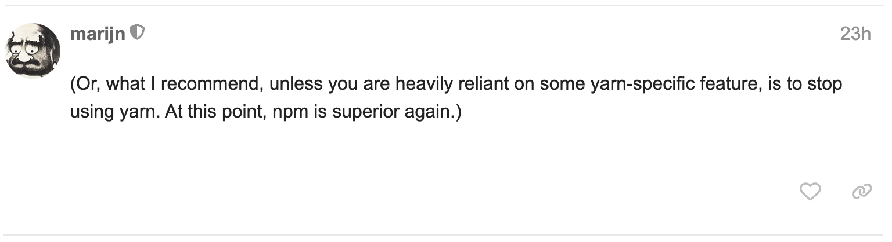

I was wandering around the [discuss.Codemirror](https://discuss.codemirror.net/) site, and I saw an opinion from the library author [marijn](https://discuss.codemirror.net/u/marijn/summary):

Source: https://discuss.codemirror.net/t/odd-behavior-for-search-functionality/8811/4

Although I've not used yarn for a really long time, I still feel the pain of using npm. Maybe I should learn about latest npm features.
