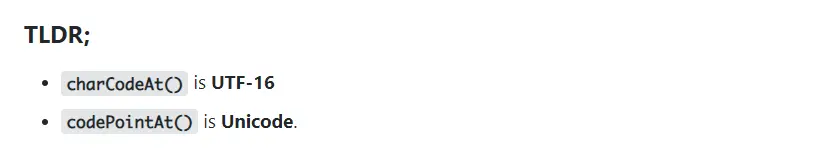

## ASCII 码转字符串

使用`String.fromCharCode()`，传入一或若干个 ascii 码，返回对应字符组成的字符串。

```ts
static String.prototype.fromCharCode(...codes: number[]): string
```

**注意**: 这是一个**静态方法**，只能在`String`类上调用。

## 字符串转 ASCII 码

使用`String.prototype.charCodeAt()`，在字符串变量上调用该方法，返回指定索引上字符的 **UTF-16** 编码。

```ts
String.prototype.charCodeAt(index: number): number
```

### 另一个 API - codePointAt()

在 MDN 上，你很容易从侧边栏看到`charCodeAt`下边，一个同样将字符转为编码的 API：

```ts
String.prototype.codePointAt(index: number): number
```

关于它们的区别，[MDN](https://developer.mozilla.org/en-US/docs/Web/JavaScript/Reference/Global_Objects/String/charCodeAt) 解释道：UTF-16 码元 (code unit) 只匹配能用**一个 UTF-16 码元**表示的 Unicode 码位 (code point)。
如果一个 Unicode 码位不能只用一个 UTF-16 码元表示，那么`charCodeAt()`只返回第一个码元对应的码位，
而`codePointAt()`返回完整的码位。

[StackOverflow](https://stackoverflow.com/questions/36527642/difference-between-codepointat-and-charcodeat) 上有个精炼的总结：


